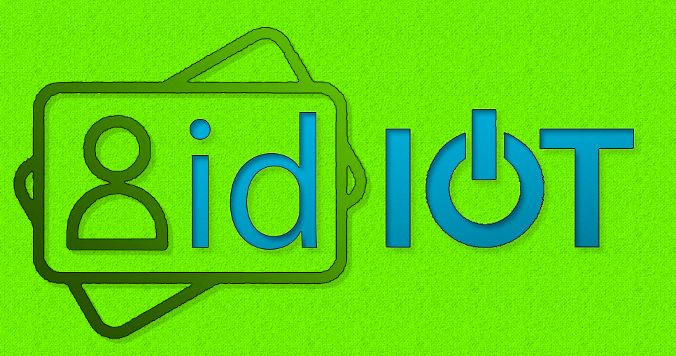

# idIOT

IOT is the F U T U R E

## Gruppe 23 dataprosjekt IELET2001 høst 2020
* Gruppemedlemmer:
	* Rokas the gamer
	* Ken the dog
	* Schimen the hacker
	* Sindre the memestar
	* Bjørnar the wise

## Todo:
* ~~Pong eksempel~~: 
	* Rokas
	* Bjørnar
	* Ken

* ~~Temperatur eksempel~~: 
	* Sindre
	* Simen

* ~~Blink eksempel~~:
	* Sindre
	* Simen

## Rapport ansvar:
* Bjørnar: 
	* bakgrunn om ESP32 
	* innledning websockets bibliotek på ESP32 (under klient)
	* metode mikrokontroller

* Rokas: 
	* innledning klient mikrokontroller
	* innledning pong
	* metode pong

* Ken:
	* ~~bakgrunn: GUI~~
	* ~~innledning GUI~~
	* metode GUI

* Sindre:
	* ~~bakgrunn protokoll~~
	* ~~innledning temperatur måler~~
	* ~~metode temperatur måler~~
	* ~~metode egen protokoll~~

* Simen
	* ~~innledning server og database~~
	* ~~bakgrunn serverside~~
	* metode server
	* ~~innledning blink~~
	* ~~metode blink~~
